# iTerm2 Color Schemes

## About

This project contains color schemes for [iTerm2](http://www.iterm2.com).
Screenshots below and in the [screenshots](screenshots/) directory.

## Whats new?

I am now using [screenshotTable.sh](https://github.com/mbadolato/iTerm2-Color-Schemes/blob/master/tools/screenshotTable.sh) (from [iTerm2-Color-Schemes](https://github.com/mbadolato/iTerm2-Color-Schemes)) to generate screenshots.

## iTerm2 Screenshots

#### AdventureTime
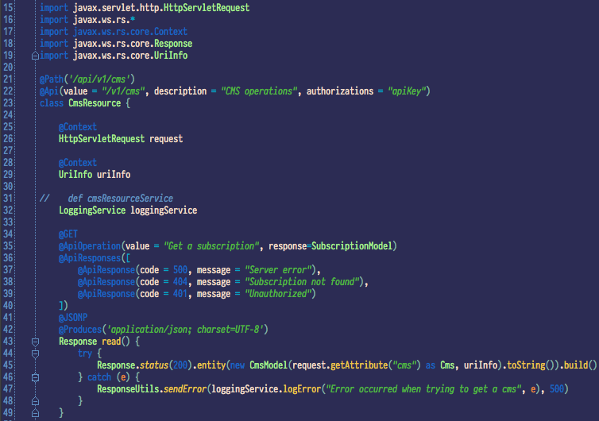
#### AlienBlood
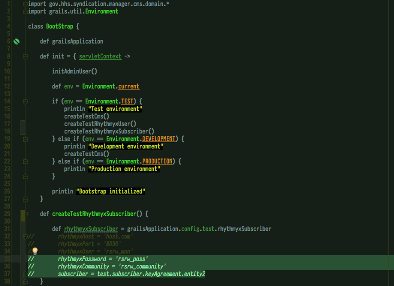
#### BirdsOfParadise
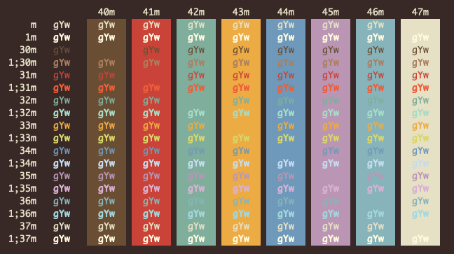
#### Ciapre
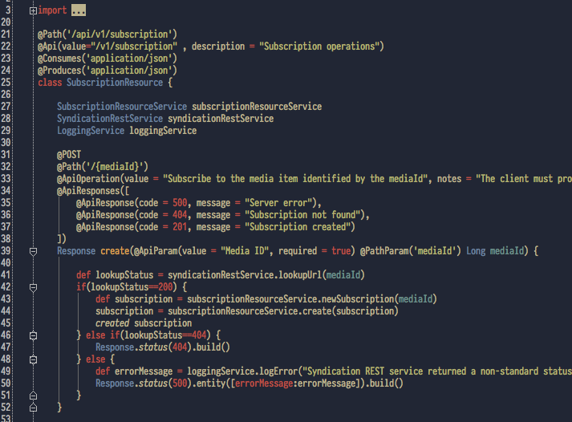
#### CrayonPonyFish
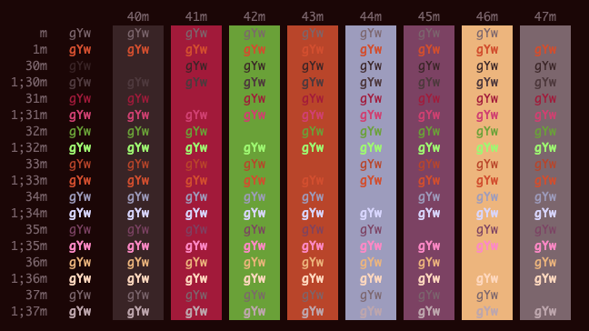
#### DimmedMonokai
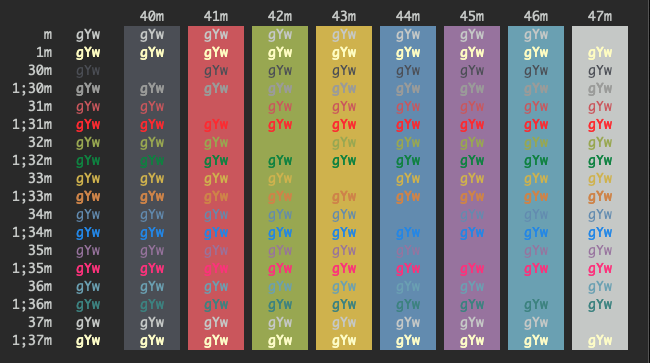
#### Earthsong
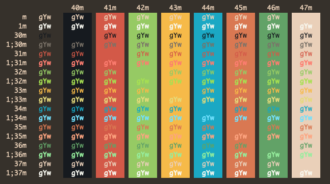
#### Elemental
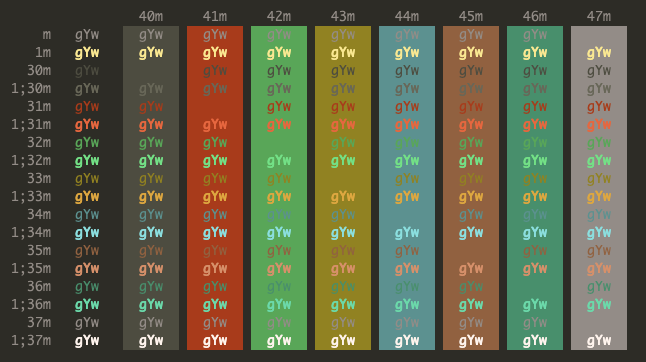
#### FishTank
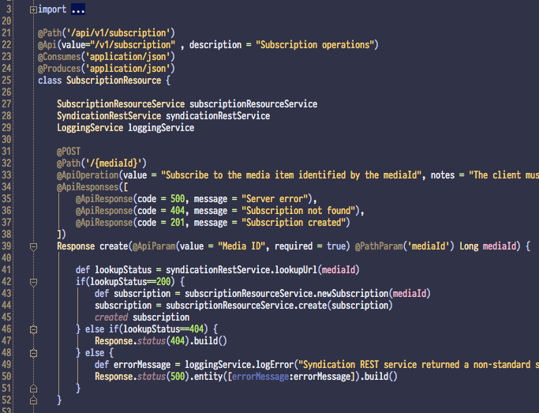
#### FrontEndDelight
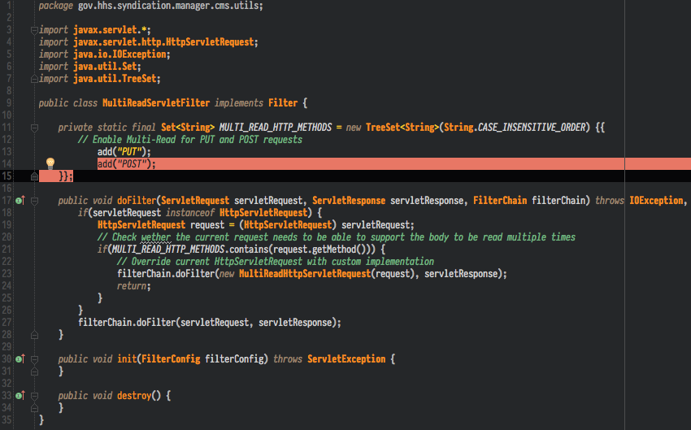
#### FunForrest
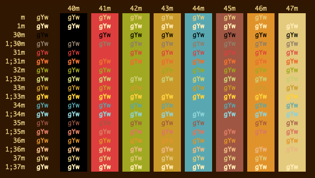
#### Grape
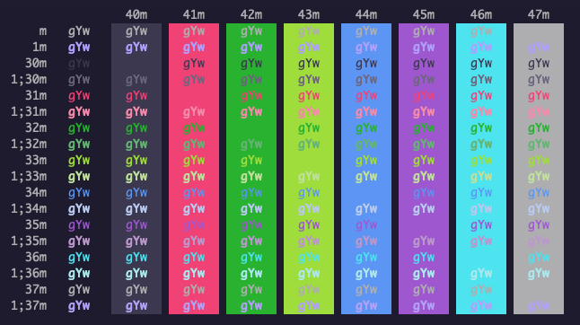
#### Highway

#### IC_Green_PPL
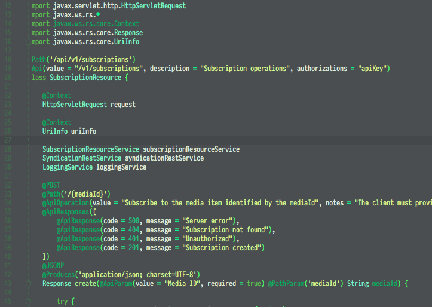
#### IC_Orange_PPL
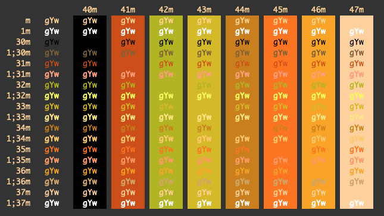
#### Lavandula
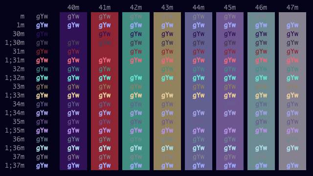
#### Medallion
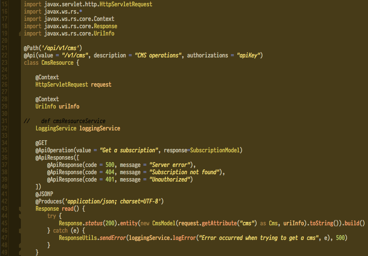
#### MonaLisa
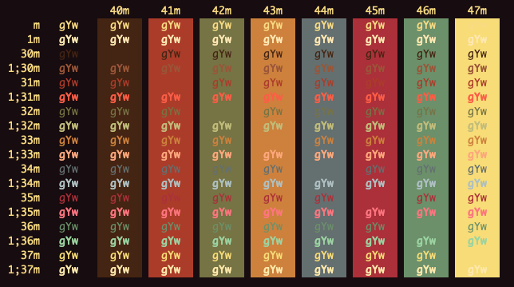
#### Ollie
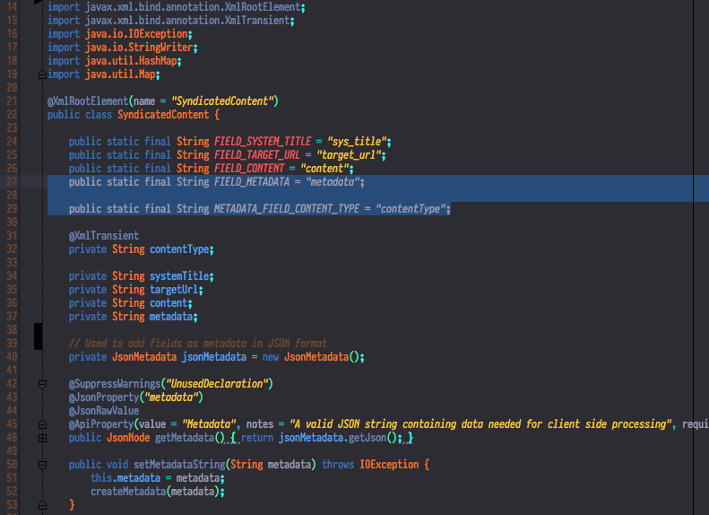
#### Royal
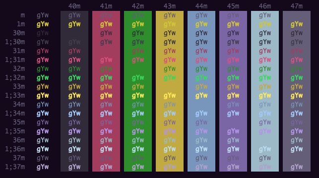
#### SeaShells
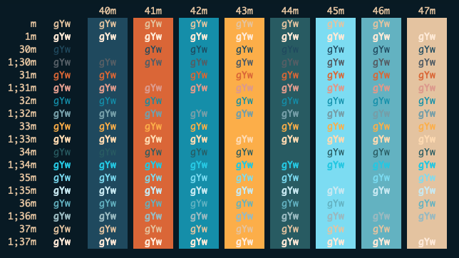
#### Shaman
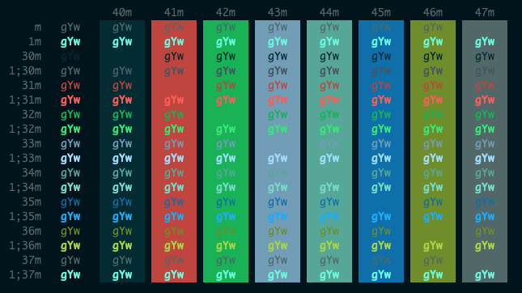
#### SleepyHollow
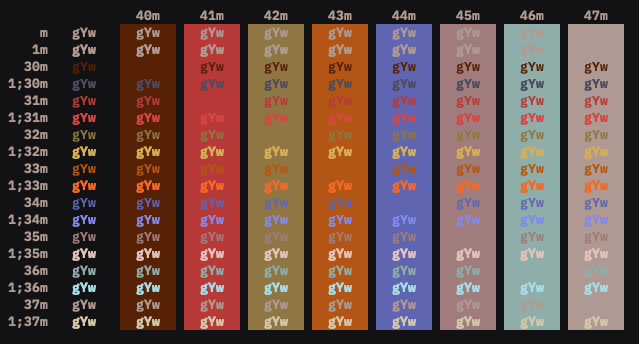
#### SoftServer
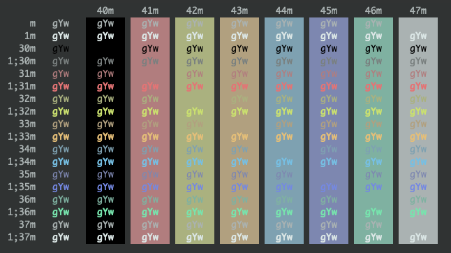
#### Sundried
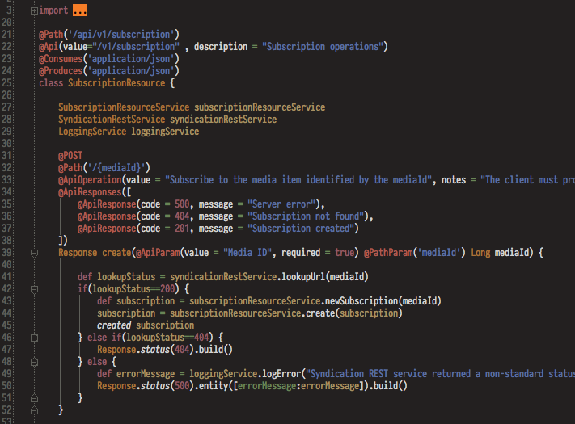
#### TheCoralDeeps
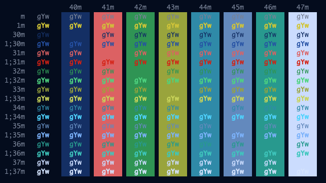
#### ToyChest
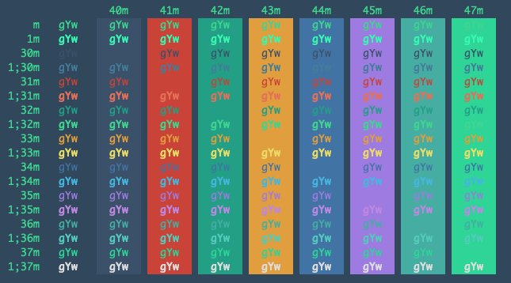
#### Treehouse
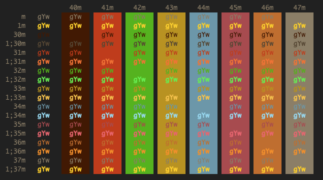
#### Urple
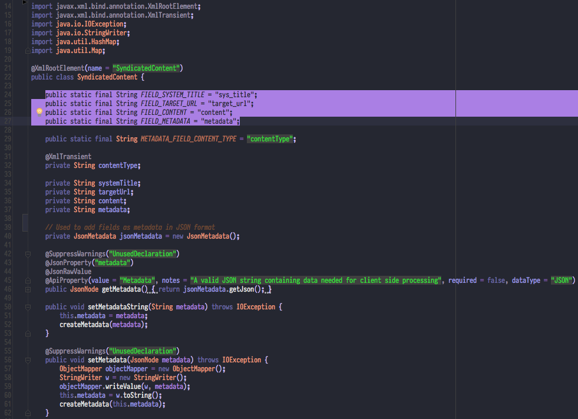
